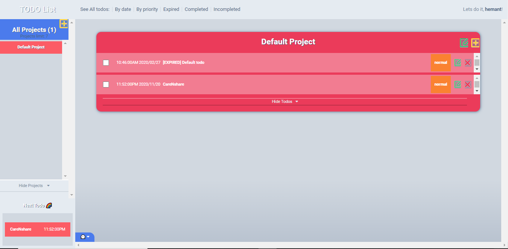

    
  
 
   
  <h3 align="center">Todo List - <a href=''> Live version</a></h3> 
  
 This project is part of the Microverse Javacript Section 
    
  <a href="https://github.com/hemant-soni-vst-au4/To-do/issues">Report Bug</a> 
  · 
  <a href="https://github.com/hemant-soni-vst-au4/To-do/issues">Request Feature</a> 
  
 
  

## Table of Contents

- [About the Project](#about-the-project)
  - [Installation](#installation)
  - [Built With](#built-with)
- [Author](#Author)
- [Acknowledgements](#acknowledgements)

## About The Project

This project consists in a application that users can create projects and set a list of tasks - todos - to help them to manager their time and organize tasks. In this app users can:

  - create maximum 7 projects;
  - create todos inside projects;
  - see completed, incompleted and expired todos;
  - mark todos as completed;
  - set a day and time to each todo;
  - set low, normal and high priority to each todo;
  - see the next todo;
  - see todos ordered by date or by priority;
  - edit and delete todos.

  

## Installation

Download or clone the [repo here](https://github.com/hemant-soni-vst-au4/To-do), enter the directory in the terminal and run the commands:

- `npm i`
- `npm run bundle`
- `npm run start`
  Your default browser should open the app at the localhost:8080

### Built With

This project was built using these technologies.

- HTML
- CSS3
- Vanila Javascript
- Webpack

## Author

👤 **Hemant soni**

- Github: [@githubhandle](https://github.com/hemant-soni-vst-au4)
- Twitter: [@twitterhandle](https://twitter.com/abdelperez11)
- Linkedin: [linkedin](https://www.linkedin.com/in/hemant-soni-97427b193/)

## Acknowledgements

- [Microverse](https://www.microverse.org/)
- [The Odin Project](https://www.theodinproject.com/)
- [MDN](https://developer.mozilla.org/en-US/docs/Web/JavaScript)
